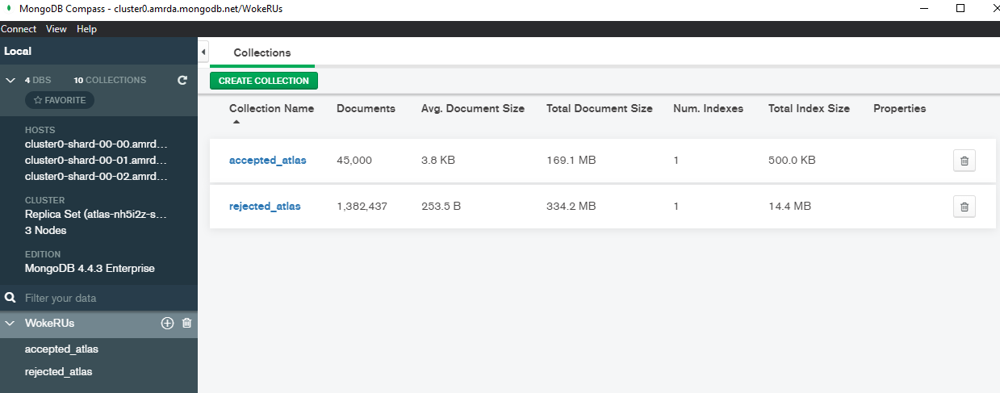

 

LendingClub is a company that enables people looking to apply for unsecured personal loans by supplying details about themselves and the loans that they would like to request (between 1K-40K). On the basis of the borrower’s credit score, credit history, employment history, desired loan amount and the borrower’s debt-to-income ratio, LendingClub determined whether the borrower was creditworthy and allowed the loan or not. The team at WokeRUs looked to investigate if it was possible to predict the approval of any loan based upon features listed. This was explored in the various branches on the repository as follows:

## Project Outline:

The following is the project outline, with more details on each of the steps discussed further down in the different sections:

- Data was downloaded from Kaggle for accepted and rejected loans.
- The data was first cleaned up to make sure the same required columns for accepted and rejected data were present in a single file.
- The two datasets were merged with only the required columns included.
- Machine learning was used to predict if a loan will be accepted or rejected based on the columns selected.
- Data for accepted loans was looked at once more to determine what columns affect interest rates
- Data was cleaned up with all unnecessary columns removed.
- 5 different interest rate ranges were determined based on the "grades" assigned by lending club
- The top columns that affected this grade were selected for deep machine learning, to predict an interest rate range for an accepted candidate based on the most influencial columns. 

 

The technology.md describes the process taking of raw datasets and how they were transformed into a model that we used for our machine learning model. For quick reference, these are the resources that we used:

- Data Extracted kaggle dataset - [Lending Club loan data](https://www.kaggle.com/wordsforthewise/lending-club)
- Data dictionary kaggle - [Dictionary](https://www.kaggle.com/jonchan2003/lending-club-data-dictionary)
- VS Code v1.52.1
- Jupyter Notebooks v6.0.3
- Python v3.7.9
- GitHub
- Zoom Client for Meetings v5.4.9

## Communication Protocol
The main methods of communication were using Slack for daily updates via text, and Zoom for virtual meetings 4 times a week. Additionally, GitHub commit comments were used to indicate any changes done to ensure that the team members are aware of changes.

## Dataset Exploratory Analysis

- The dataset was available to us in a.csv file, and since only two tables were present an ERD was not necessary
- The datasets were large and importing the datasets into our repository was fairly straightforward and less daunting than expected.
- Since our datasets were classified into two main categories one being accepted for loan and the other rejection, we did analyze the columns (a run through) to find relational contents of both datasets.
- There are about 27 million data points on the rejected data, and 2 million data points with the accepted datasets. (highly skewed or biased towards rejections of loan applications)
- The features were way too detailed when looking at the accepted dataset (151 features) when compared to the rejected dataset (9 features)
- After discussion data points or features from applicants that were rejected, were deemed important and considered for our initial learning model.
- The data contained many missing values in regards to the rejected dataset, this amounted to 18 million data points being dropped. (slightly reducing the imbalance)
- In further exploratory analysis, cleaning data was carried out where most of our features were having characters paired with numerics.
- After a thorough run with data preprocessing and cleaning, we have achieved criteria that seem to play a vital role in deciding or rejecting a loan application.
- This dataset will be tied into our analysis further. (maybe consider other valuable features and also predict an individual's chance of securing a loan)

 

## Database Setup and Communication

- Our search for a more refined or clean data was not successful, and the lending club dataset being the most comprehensive.
- The dataset was uploaded into GitHub as a large file transfer.
- Using the data uploaded on to GitHub, data was then wrangled for optimizing our dataset to suit our needs and the initial machine learning algorithm.
- 4 branches were initialized and setup on Github to ensure that the database and contents do not be overwritten (just because the sheer size)
- Main communication is through zoom client for meetings software and slack for progress tracking and deliverables time line.

## Database

- Since the data we possess do not have any relational features that we could use or create an ERD, the datasets we have were merged into one big consolidated dataset.
- Since there is no schema, we collectively decided to use MongoDB as this was the easiest way to store our data.
- Storing data locally (each members PC) was the easiest form to work with as dealing with resources such as storage space on the cloud was challenging.
- We Decided to sample our large dataset, 5% of the raw data, was sampled to stay within the limits of our allocated space and memory usage on the cloud (MongoDB Atlas)
- Successfully exported the dataset (accepted and rejected files at 5% sampled data) and we were able to also import it to our notebook.
- Our dataset is massive, hence we want to make use of every data point we can to generate a better model for prediction as well as classification.
- Hence, our main raw or original dataset is still available locally to ensure we are using our resources to its maximum potential.

# Machine Learning for Lending Prediction

The project implements Machine Learning in two progressive stages:

## Stage 1: Binary Classification

The first Machine Learning ALgorithm trains a binary classifier to predict if the applicant should be accepted or rejected for a loan from Lending Club. 
The following algorithms will be used and compared for accuracy and implementation efficiency:
1. Logistic Regression
2. SVM Algorithm
3. Neural Networks

## Stage 2: Interest Prediction

The second Machine Learning Algorithm trains a regression model to predict the interest rate that should be provided to an accepted loan borrower.
The following algorithms will be used and compared for accuracy and implementation efficiency:
1. Polynomial regression
2. Decision Tree Algorithm
3. Neural Networks

## Current Progress

### Stage 1 Analysis

- The team has successfully implemented the decision tree algorithm for Stage 1 Analysis (classifying Loan accepted or not), yielding an 93.9% accuracy on test data.

### Stage 2 Analysis

- To implement a binning of applicants based on 28 features to predict the range of interest rates the applicant would fall under.
- Currently deciding on dealing with nan values (either removing or replacing)
- we should have a decision by next deliverable.

 

